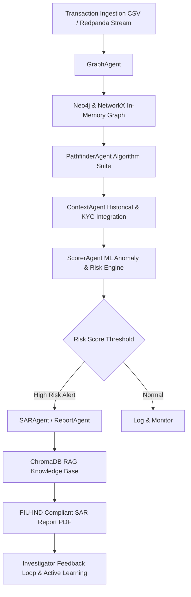

# 🛡️ GraphSentinel

> **AI-Powered Fund Flow Fraud Detection & Anti-Money Laundering (AML) Intelligence System**  
> *VIT Pune Grand Hackathon 2026 | Problem Statement PS3 | Track: FinTech & Fraud Prevention*  
> **Submitted by Team Elida (MMIT Pune)** — *Winners, VOIS Innovation Marathon 2.0*

[](https://opensource.org/licenses/MIT)
[](https://www.python.org/)
[](https://fastapi.tiangolo.com/)
[](https://nextjs.org/)
[](https://neo4j.com/)
[](https://redpanda.com/)
[](https://www.docker.com/)

---

## 📌 Executive Summary

**GraphSentinel** is an enterprise-grade, graph-native Fund Flow Fraud Detection system designed to unmask complex, multi-hop money laundering schemes that legacy banking infrastructure systematically misses. By combining high-performance graph topological algorithms with an LLM-powered multi-agent orchestration framework, GraphSentinel transforms fragmented transaction feeds into a queryable, living knowledge graph.

### 💡 Value Proposition & Efficiency Impact

Legacy rule-based Anti-Money Laundering (AML) platforms suffer from **90–98% false-positive rates**, swamping compliance teams with benign flags and requiring 3 to 5 days of manual investigation per alert.

| Metric | Legacy AML Systems | GraphSentinel Target |
| :--- | :--- | :--- |
| **False Positive Rate** | 90–98% | **< 40%** |
| **Multi-Hop Traversal** | 1–3 hops max | **Up to 50 hops** |
| **Graph Pattern Detection** | Hours / Batch | **< 4 Seconds** |
| **FIU-IND SAR Pre-Population** | Manual (4+ hours) | **~45 Seconds (AI-Drafted)** |
| **Total Case Investigation Time** | 3–5 Days | **~20 Minutes (20x Efficiency Gain)** |

---

## 🔍 Fraud Typologies Detected

GraphSentinel detects six high-risk financial crime topologies through algorithmic graph analysis and machine learning:

```
┌─────────────────────────┬────────────────────────────────────────────────────────────────────────────┐
│ Fraud Pattern           │ Graph Topology & Algorithmic Detection Signature                          │
├─────────────────────────┼────────────────────────────────────────────────────────────────────────────┤
│ 🔁 Round-Tripping        │ Circular fund flows returning to origin (Tarjan's SCC & nx.simple_cycles)  │
│ 🐜 Smurfing / Structuring│ High-frequency, sub-threshold transfers aggregating to a single target     │
│ 🕸️ Hub-and-Spoke        │ Central routing nodes fanning out or fanning in large volumes              │
│ ⚡ Pass-Through Relay   │ Accounts with rapid transit velocity and near-zero balance retention       │
│ 💤 Dormant Activation    │ Long-dormant accounts suddenly executing high-volume transfers             │
│ ⏳ Temporal Layering     │ Time-staggered multi-hop chains structured across extended windows         │
└─────────────────────────┴────────────────────────────────────────────────────────────────────────────┘
```

---

## 🛠️ Multi-Agent Architecture & Pipeline

GraphSentinel leverages a modular multi-agent workflow inspired by the **Elida Multi-Agent Framework**:



### Agent Roles

- 🤖 **GraphAgent**: Builds and updates directed property graphs with accounts as nodes and transactions as edges.
- 🎯 **PathfinderAgent**: Runs topological graph algorithms (SCC, Louvain community detection, PageRank, shortest path velocity).
- 🧠 **ContextAgent**: Evaluates transactional context, historical baselines, and account metadata.
- ⚖️ **ScorerAgent**: Combines rule weights, ML anomaly scores (Isolation Forest / XGBoost heuristics), and risk factors into a unified score (0–100).
- 📄 **ReportAgent & SARAgent**: Generates regulatory-compliant Suspicious Activity Reports (SAR) with LLM explanations and FIU-IND formatting.
- 💬 **Regulatory RAG Chatbot**: Answers compliance queries using ChromaDB vector search over RBI Master Directions & PMLA regulations.

---

## 🧰 Technology Stack

### Backend
- **Framework**: Python 3.11+, FastAPI, Uvicorn, Pydantic v2
- **Graph Processing**: NetworkX, Neo4j 5 Community Edition (Bolt Driver)
- **Database & Storage**: PostgreSQL 16 (Feedback & Scorer Config), Redis 7 (Caching)
- **Streaming & Messaging**: Redpanda (Kafka-compatible event broker)
- **Vector DB & RAG**: ChromaDB 0.5.4, OpenRouter / OpenAI / Anthropic API
- **Testing**: Pytest, Pytest-Cov, Asyncio

### Frontend
- **Framework**: Next.js 16 (App Router), React 19, TypeScript
- **Styling & UI**: Tailwind CSS v4, Framer Motion, Lucide React, Radix UI / Base UI
- **Graph Visualization**: `react-force-graph-2d` (Interactive 2D force-directed node visualizer)
- **Reporting & Export**: `html2pdf.js` for instant SAR PDF downloads
- **Testing**: Playwright (E2E Integration Testing)

---

## 📁 Repository Structure

```
bank/
├── backend/
│   ├── app/
│   │   ├── agents/          # SAR generation and multi-agent handlers
│   │   ├── auth/            # JWT authentication & Role-Based Access Control (RBAC)
│   │   ├── cache/           # Redis caching utilities
│   │   ├── events/          # Redpanda / Kafka producer & streaming consumer
│   │   ├── graph_store/     # Neo4j graph store connector
│   │   ├── ml/              # Machine learning anomaly detectors & feature extractors
│   │   ├── pipeline/        # GraphSentinel core orchestrator & detection agents
│   │   ├── privacy/         # PII token vault & cryptographic anonymization
│   │   ├── rag/             # ChromaDB vector store & PMLA/RBI knowledge base
│   │   ├── simulation/      # IBM AMLSim synthetic dataset generator
│   │   └── main.py          # FastAPI application entrypoint & REST API endpoints
│   ├── config/              # Centralized environment configuration
│   ├── data/                # Pre-loaded transaction datasets & schemas
│   ├── demo_cache/          # Pre-cached instant demo responses
│   ├── tests/               # Pytest suite
│   ├── Dockerfile           # Backend multi-stage container
│   └── requirements.txt     # Python dependency manifest
├── frontend/
│   ├── src/
│   │   ├── app/             # Next.js 16 App Router pages
│   │   ├── components/      # UI components (GraphVisualizer, RiskRing, SARReport, AlertFeed)
│   │   ├── lib/             # WebSocket client & API utilities
│   │   └── types/           # TypeScript API interfaces
│   ├── tests/               # Playwright E2E test specs
│   ├── package.json         # Node.js dependencies
│   └── Dockerfile           # Frontend container definition
├── data/                    # Shared synthetic datasets
├── docker-compose.yml       # Production & dev container orchestrator
├── prd.md                   # Complete Product Requirements Document (PRD)
├── GraphSentinel_PROGRESS.md# Task tracking & implementation progress report
├── start.bat                # Windows quick launcher
└── README.md                # Main repository documentation
```

---

## 🚀 Quick Start Guide

### Prerequisites

- **Docker & Docker Compose** (Recommended)
- Or **Node.js 20+** and **Python 3.11+** for local development.

---

### Option A — Run with Docker Compose (Recommended)

1. **Clone the repository:**
   ```bash
   git clone https://github.com/Pruthvi3715/bank.git
   cd bank
   ```

2. **Configure environment variables (Optional):**
   ```bash
   # Optional: Add your OpenRouter or OpenAI API Key for live LLM SAR generation
   export OPENROUTER_API_KEY="your-api-key"
   ```

3. **Launch all services:**
   ```bash
   docker-compose up --build
   ```

4. **Access the application:**
   - 🌐 **Frontend Dashboard**: [http://localhost:3000](http://localhost:3000)
   - ⚡ **Backend API Documentation (Swagger)**: [http://localhost:8000/docs](http://localhost:8000/docs)
   - 🟢 **Neo4j Browser**: [http://localhost:7474](http://localhost:7474) (Credentials: `neo4j` / `graphsentinel123`)
   - 🔴 **Redpanda Schema/Broker Console**: [http://localhost:8081](http://localhost:8081)

---

### Option B — Local Development

#### 1. Backend Setup

```bash
cd backend

# Create & activate virtual environment
python -m venv venv
# On Linux/macOS:
source venv/bin/activate
# On Windows:
venv\Scripts\activate

# Install dependencies
pip install -r requirements.txt

# Run in DEMO Mode (Uses pre-cached instant responses)
DEMO_MODE=1 uvicorn app.main:app --reload --port 8000

# Or run in Live Detection Mode
DEMO_MODE=0 uvicorn app.main:app --reload --port 8000
```

#### 2. Frontend Setup

```bash
cd frontend

# Install Node modules
npm install

# Start Next.js development server
npm run dev
```

Open [http://localhost:3000](http://localhost:3000) in your browser.

---

## 🔌 API Endpoints Summary

| Method | Endpoint | Description |
| :--- | :--- | :--- |
| `GET` | `/api/health` | Service health status |
| `GET` | `/api/demo-track-a` | Instantly returns pre-cached demo analysis |
| `POST` | `/api/run-pipeline` | Triggers detection on current dataset (live or cached) |
| `POST` | `/api/run-pipeline-csv` | Runs detection pipeline on uploaded transaction CSV |
| `POST` | `/api/run-pipeline-csv/stream` | Streams uploaded CSV transactions to Redpanda/Kafka |
| `GET` | `/api/streaming/status` | Status of streaming consumer & buffer metrics |
| `POST` | `/api/feedback` | Saves investigator approval/rejection decision |
| `GET` | `/api/feedback/config` | Retrieves dynamic risk scorer configuration |
| `POST` | `/api/sar/generate` | Generates FIU-IND compliant SAR report via LLM |
| `POST` | `/api/rag/chat` | RAG regulatory compliance assistant query |
| `GET` | `/api/adversarial-test` | Runs adversarial fraud simulation test suite |

---

## 🧪 Testing & Verification

### Backend Unit & Integration Tests

```bash
cd backend
pytest tests/ -v
```

To run test coverage report:
```bash
pytest tests/ --cov=app --cov-report=term-missing
```

### End-to-End Frontend Tests

```bash
cd frontend
npx playwright test
```

---

## 🏆 Awards & Competition Recognition

- 🥇 **Winners** — *VOIS Innovation Marathon 2.0* (Prize: ₹2,00,000)
- 🎯 **Grand Finalist** — *VIT Pune Grand Hackathon 2026* (Problem Statement PS3: FinTech & Fraud Detection)

---

## 📄 License & Disclaimer

This project is licensed under the [MIT License](LICENSE).  
*GraphSentinel is built for hackathon demonstration and research purposes. Synthetic data generation uses simulated banking transaction structures (IBM AMLSim format).*
